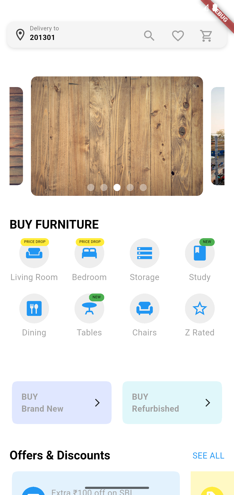
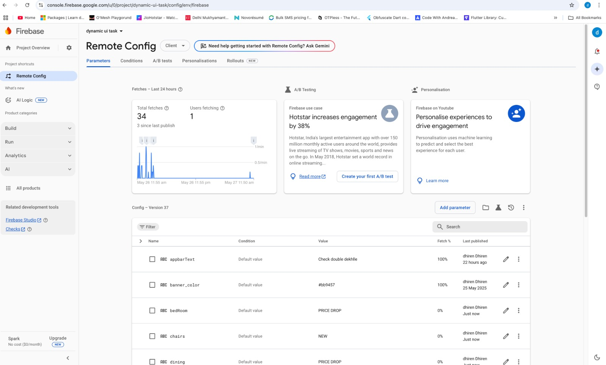

# Dynamic UI with Firebase Remote Config in Flutter

This Flutter project demonstrates how to create a **dynamic UI** where the **order**, **color**, and **size** of widgets can be changed remotely using **Firebase Remote Config**.

## ✨ Features

- 🔄 Dynamically change the **order** of widgets (e.g., cards, buttons).
- 🎨 Update **colors** of widgets from Remote Config without releasing new app versions.
- 📏 Modify **size** (width, height, padding, font size) of UI elements on the fly.
- 🛠 Powered by **Firebase Remote Config** to provide live updates.

## 📸 Screenshots

Below are example screenshots demonstrating dynamic changes based on Remote Config values.

### 🔷 Example 1: Default Layout


### 🔶 Example 2: Reordered and Resized Widgets


### 🟢 Example 3: Custom Colors Applied


## 🧠 How it Works

1. Firebase Remote Config parameters control:
   - `widget_order`: A list of widget IDs to determine the order of rendering.
   - `widget_colors`: A map of widget IDs to their color hex values.
   - `widget_sizes`: A map of widget IDs to size parameters (e.g., height, width, font size).

2. The app fetches Remote Config and updates the UI accordingly:
   - On startup and optionally on pull-to-refresh.
   - Uses `setState()` or reactive state management to rebuild with new config.

3. Example Firebase Remote Config JSON:
```json
{
  "widget_order": ["header", "image", "button"],
  "widget_colors": {
    "header": "#FF5733",
    "button": "#33FF57"
  },
  "widget_sizes": {
    "header": {"fontSize": 24},
    "button": {"width": 200, "height": 50}
  }
}
