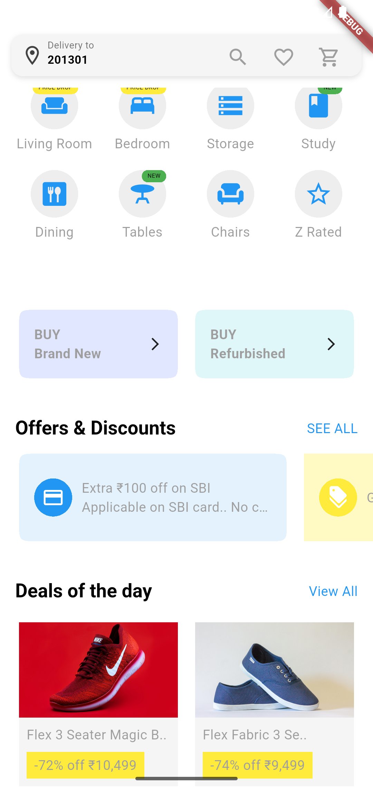

# 🧩 Dynamic UI with Firebase Remote Config in Flutter

This Flutter project demonstrates how to create a **dynamic UI** where the **order**, **color**, and **size** of widgets can be changed remotely using **Firebase Remote Config**.

> ✅ Built with **Flutter 3.29.3**

---

## ✨ Features

- 🔄 Dynamically change the **order** of widgets (e.g., cards, buttons).
- 🎨 Update **colors** of widgets from Remote Config without releasing a new version.
- 📏 Modify **size** (width, height, padding, font size) of UI elements live.
- ⚙️ Powered by **Firebase Remote Config** for real-time updates.

---

## 🔧 Configurable UI Parameters

These Remote Config parameters are dynamically fetched and used:

| Parameter              | Purpose                                        | Example Value                                                   |
|------------------------|------------------------------------------------|------------------------------------------------------------------|
| `HomeWidgets`          | Controls the order of widgets                  | `siderWidget,gridView,buyCard,offerWidget,dealWidget`           |
| `banner_color`         | Sets banner background color                   | `#bb9457`                                                       |
| `primary_color`        | App's primary theme color                      | `#FFC0CB`                                                       |
| `heading_font_size`    | Heading text font size                         | `20`                                                            |
| `gridViewCrossAxis`    | Number of columns in grid view                 | `4`                                                             |
| `sliderImages`         | URL for remote banner image                    | Image URL from Pexels                                           |
| `appbarText`           | Text displayed in the AppBar                   | `Check double dekhle`                                           |
| `bedRoom`, `dining`, `chairs`, `storage` | Category labels                 | `NEW`, `PRICE DROP`                                             |

---

## 📸 Screenshots

These screenshots show how the UI adapts based on the Remote Config values.

| Default Layout | Reordered Widgets |
|----------------|------------------|
|  |  |

### 🟢 Example 3: Custom Colors Applied


---

## 📦 Setup Instructions

### 1. Clone the Project
```bash
git clone https://github.com/your-username/flutter-dynamic-ui-remote-config.git
cd flutter-dynamic-ui-remote-config
